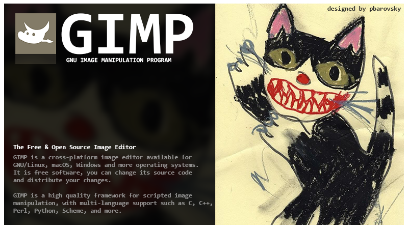
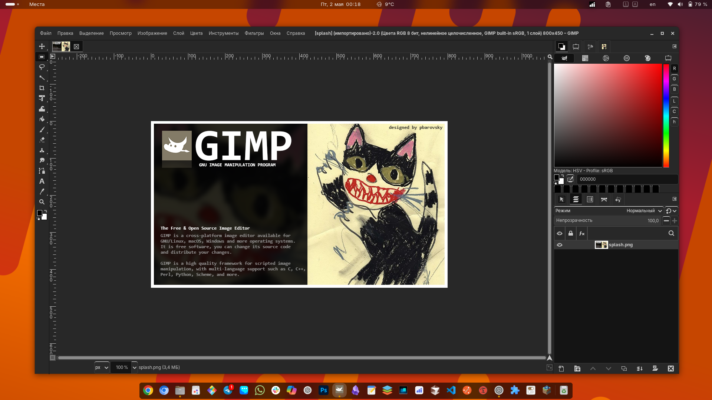

# PhotoGimp fresh

<table style="border-collapse: collapse; width: 100%;">
  <tr>
    <td style="vertical-align: top; width: 200px;">
      
    </td>
    <td style="vertical-align: top; padding-left: 20px;">
      <p>Patch for GIMP 3+ for Adobe Photoshop users (but Linux enthusiasts), including features such as:</p>
      <ul>
        <li>New splash screen at startup</li>
        <li>New shortcut icon</li>
        <li>Tools organized to mimic Photoshop position</li>
        <li>New default settings to maximize canvas space</li>
        <li>Key combinations similar to Photoshop</li>
      </ul>
    </td>
  </tr>
</table>

## Screenshots

<p align="center">
  
</p>
<p align="center"><em>Image at Gimp startup</em></p>

<p align="center">
  
</p>
<p align="center"><em>GIMP 3 with "PhotoGimp fresh" patch applied</em></p>

## How to install
### ONLY FLATPAK VERSION OF GIMP

The patch is designed to work with the Linux version of GIMP.

To install "PhotoGimp fresh" on your Linux operating system, just follow these simple steps:

1. Make sure you already have GIMP installed (**flatpak version recommended**).
2. **Start and exit GIMP after installation before proceeding!**
3. Download the files from this repository

```bash
git clone https://github.com/pbarovsky/PhotoGimp-fresh.git
```

4. Run the installer script in terminal

```bash
chmod +x ./install.sh
./install.sh
```

5. You're all set.

## Uninstall

1. Uninstall Gimp via the application center (e.g. Gnome Software).
2. Manually remove the `org.gimp.GIMP.desktop` shortcut from the `~/.local/share/applications` folder.
